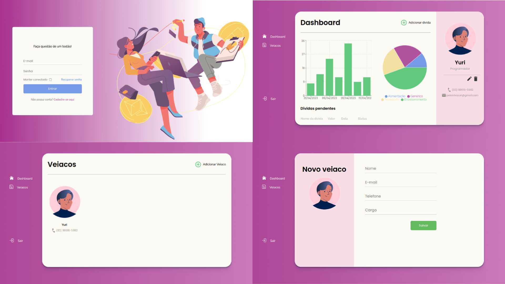

<div align="center">
     
</div>

<h4 align="center">Veiaco: porque gerenciar dívidas de amigos nunca foi tão fácil (ou menos constrangedor)</h4>

<p align="center">
    
    
    
</p>

<p align="center">
  <a href="#sobre">Sobre</a> •
  <a href="#funcionalidades">Funcionalidades</a> •
  <a href="#notas-importantes">Notas importantes</a> •
  <a href="#galeria">Galeria</a> •
  <a href="#instalação">Instalação</a> •
  <a href="#contribuindo">Contribuindo</a> •
  <a href="#contato">Contato</a> •
  <a href="#licensa">Licensa</a>
</p>


<br>

## Sobre

O Veiaco foi criado a partir de uma necessidade pessoal (e uma memória ruim) para gerenciar dívidas de amigos e pessoas próximas. Com essa ferramenta incrível, você pode adicionar suas dívidas em um único lugar, gerenciá-las com facilidade e ter acesso a gráficos e dashboards inteligentes que te ajudam a manter suas finanças sob controle. O Veiaco é a solução perfeita para quem busca uma maneira amigável e eficaz de lidar com suas dívidas e cuidar melhor do seu dinheiro.

## Funcionalidades

> **Note**
> Funcionalidades da pre-release - v1.0

- Gerenciamento de Dívidas
  - O Veiaco ajuda os usuários a gerenciar suas dívidas, fornecendo informações sobre o saldo devedor.
- Visualização de Dados
  - Os usuários podem adicionar facilmente dívidas ao aplicativo, inserindo informações como nome do credor, valor da dívida, data da dívida...
- Acesso Fácil
- Dashboards e gráficos
  - Os usuários podem obter insights sobre suas finanças pessoais através de dashboards e gráficos que mostram tendências de gastos e ganhos. Eles podem ver facilmente onde estão gastando mais dinheiro e como podem reduzir seus gastos.
- Funcionalidade de login para acessar a conta do usuário

## Notas importantes

- Os dados não estão criptografados durante a transferência de informação. Tenha cuidado ao inserir dados sensíveis.

- Alguns _feedbacks_ da tela não estão funcionando nessa _release_. Alguns exemplos:
  - Dados de autenticação inseridos de forma incorreta
  - Transferências de telas que deveriam ocorrer de forma natural ainda não foram inseridos
- Aguns elementos estão estáticos e não possuem nenhuma funcionalidade, como elementos em HTML (o botão de esqueceu a senha)

- O visual não está concluído. Além das cores, transições de telas e redirecionamentos precisam ser melhorados

- A **logo** não foi definida, portanto, não foi incluída nessa _release_

- As funcionalidades que dependem do _back-end_ ou estão estáticos ou estão incoerentes (valores aleatórios ou não estão funcionando corretamente ou elemento inexistente)

## Galeria

<div align="center">

### Telas principais



</div>

<br>

## Instalação

### Pré-requisitos

> **Note**
> Esse projeto possui um _back-end_ API. [Clique aqui]() para mais informações sobre o _back-end_.

Antes de rodar o front-end projeto, é necessário ter instalado em sua máquina:

- [Git](https://git-scm.com/)
- [npm](https://www.npmjs.com/)

### 📦 Clonando o repositório

```bash
$ git clone git@github.com:yagopeixinho/veiacoPlataforma.git
```

### 🔨 Rodando o projeto

```bash
# Acesse o repositório pelo terminal.
$ cd veiacoPlataforma

# Instale as dependências.
$ npm install

# Rode o projeto
$ npm start
```

### :gear: Configurações iniciais

Precisamos declarar alguns configurações para que o projeto rode sem nenhum problema.

#### Variáveis de ambiente

Para iniciarmos o projeto precisamos declarar algumas variáveis de ambiente responsáveis pela definição de informações importantes, como a URL da API. [Clique aqui]() para mais informações sobre o _back-end_.

```bash
# No diretório do projeto crie o arquivo responsável pela definição das variáveis de ambiente.
$ touch .env
```

Dentro do arquivo `.env` cole as variáveis de ambiente mínimas para rodar o projeto

```bash
# URL da API.
REACT_APP_API_URL="http://localhost:5000/api/"
```

#### Sass

Nesse projeto foi utilizado a arquitetura [7-1 Sass Architecture](https://www.learnhowtoprogram.com/user-interfaces/building-layouts-preprocessors/7-1-sass-architecture) do Sass.

```bash
# Dentro do diretório do projeto rode o comando para que seja possível modificações no CSS
$ watch sass ./src/assets/sass/main.scss ./src/assets/sass/main.css
```

## Contribuindo

Sinta-se a vontade para enviar quantos _pull request's_ forem necessários, as revisarei gradamente.

## Contato

- 📬 Me envie um e-mail: peixinhoyago@gmail.com
- Se você tem alguma dúvida ou quer entrar em contato comigo por qualquer outro motivo, você pode encontrar minhas redes sociais e mais informação sobre mim [clicando aqui](https://github.com/yagopeixinho/yagopeixinho/blob/master/README.md)

## Licensa

Esse projeto está com a licença: MIT License. [Clique aqui para mais detalhes](https://github.com/yagopeixinho/veiacoPlataforma/blob/master/LICENSE)
